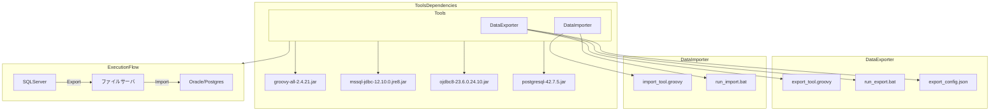

# データ同期ツール 概要設計

## ツール構成図

```mermaid
graph TD
    subgraph Tools
        direction TB
        A[DataExporter]
        B[DataImporter]
    end

    subgraph DataExporter
        direction TB
        A1[export_tool.groovy]
        A2[run_export.bat]
        A3[export_config.json]
        A --> A1
        A --> A2
        A --> A3
    end

    subgraph DataImporter
        direction TB
        B1[import_tool.groovy]
        B2[run_import.bat]
        B --> B1
        B --> B2
    end

    subgraph ToolsDependencies
        direction TB
        D1[groovy-all-2.4.21.jar]
        D2[mssql-jdbc-12.10.0.jre8.jar]
        D3[ojdbc8-23.6.0.24.10.jar]
        D4[postgresql-42.7.5.jar]
        Tools --> D1
        Tools --> D2
        Tools --> D3
        Tools --> D4
    end

    subgraph ExecutionFlow
        direction LR
        SQLServer -->|Export| FileServer[ファイルサーバ]
        FileServer -->|Import| Database[Oracle/Postgres]
    end

    Tools --> ExecutionFlow
```
