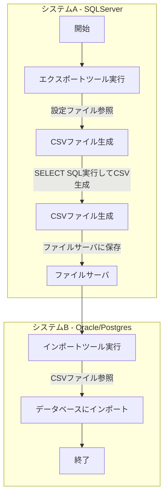

# データ同期ツール ワークフロー

## 処理の流れ

```mermaid
flowchart TD
    subgraph SystemA[システムA - SQLServer]
        Start[開始] --> Config[エクスポートツール実行]
        Config -->|設定ファイル参照| Query[CSVファイル生成]
        Query -->|SELECT SQL実行してCSV生成| GenerateCSV[CSVファイル生成]
        GenerateCSV -->|ファイルサーバに保存| FileServer[ファイルサーバ]
    end
    subgraph FileServer[ファイルサーバ]
        
    end

    subgraph SystemB[システムB - Oracle/Postgres]
        FileServer --> Import[インポートツール実行]
        Import -->|CSVファイル参照| LoadDB[データベースにインポート]
        LoadDB --> End[終了]
    end
```
