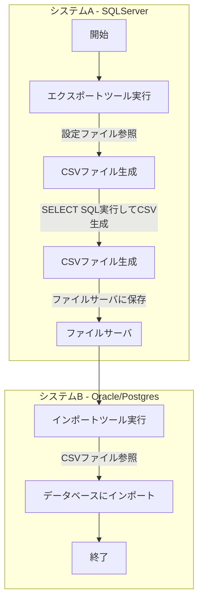

# データ同期ツール ワークフロー

## 処理の流れ

---

## 2025-06-11 拡張仕様

- インポート時、1つのテーブルに対して複数ファイルを順次取り込むパターンをサポート。
- deleteBeforeInsertの条件分岐（全件削除・条件付き削除・削除なし）をサポート。
- 詳細は import_config.example.json, test_import_config.json を参照。

---
